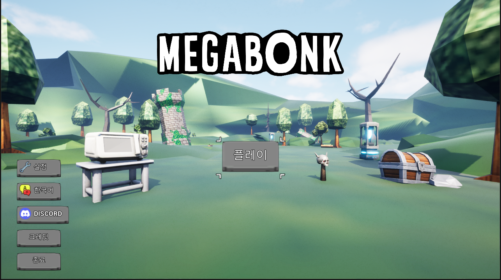
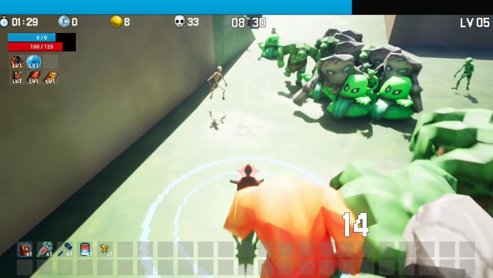

# 🎮 MegaBonk Clone

<p align="center">
  
</p>

<p align="center">
  
  
  
  
</p>

---

## 📌 프로젝트 소개

> MegaBonk를 모티브로 제작한 로그라이크 액션 슈팅 게임

| 항목 | 내용 |
|:---|:---|
| 🎮 장르 | 로그라이크 액션 슈팅 |
| 🖥️ 대상 플랫폼 | Windows (PC) |
| 👥 개발 인원 | 프로그래머 4명 (김성현, 김민준, 김수진, 유성민) |
| ⚙️ 개발 환경 | Unreal Engine 5, C++ |

---

## 🎬 시연 영상

<p align="center">
  <a href="https://youtu.be/bEvH_hcpQ2w?si=mK_SqWORtcX_3JI5">
    
  </a>
</p>

---

## ✨ 주요 기능

| 기능 | 설명 | 코드 바로가기 |
|:---|:---|:---:|
| 플레이어 시스템 | 이동, 스탯, 충돌 및 피격 판정 | [바로가기](./Source/MegaBonkClone/Public/Characters/PlayAbleCharacter/PlayerCharacter.h) |
| 스탯 컴포넌트 | HP·공격력·이동속도 등 캐릭터 스탯 통합 관리 | [바로가기](./Source/MegaBonkClone/Public/Characters/Components/StatusComponent.h) |
| 무기 시스템 | 투사체·부메랑·오라·궤적 등 다양한 무기 타입 구현 | [바로가기](./Source/MegaBonkClone/Public/Characters/Components/WeaponSystemComponent.h) |
| 오브젝트 풀 | 투사체·이펙트 재사용을 위한 풀 시스템 | [바로가기](./Source/MegaBonkClone/Public/Framework/ObjectPoolSubsystem.h) |
| 몬스터 AI | 플레이어 인식·추적 AI 및 웨이브 스폰 | [바로가기](./Source/MegaBonkClone/Public/Characters/Enemy/EnemyBase.h) |
| 보스 패턴 | 보스 몬스터 스포너 및 고유 패턴 구현 | [바로가기](./Source/MegaBonkClone/Public/Interactables/BossSpawnerActor.h) |
| 로그라이크 성장 | 레벨업 시 무작위 무기·패시브 선택 빌드 | [바로가기](./Source/MegaBonkClone/Public/Components/RewardSystemComponent.h) |
| 인벤토리 시스템 | 아이템·무기·비전서 인벤토리 관리 | [바로가기](./Source/MegaBonkClone/Public/Components/InventoryComponent.h) |
| 상호작용 오브젝트 | 성소(버프·회복·저주 등) 및 상자·상점 오브젝트 | [바로가기](./Source/MegaBonkClone/Public/Interactables/SanctuaryBase.h) |
| UI 시스템 | 메인 HUD, 인벤토리, 상점, 스탯, 데미지 텍스트 UI | [바로가기](./Source/MegaBonkClone/Public/UI/MainHudWidget.h) |
| 사운드 시스템 | 게임 전반 사운드 통합 관리 | [바로가기](./Source/MegaBonkClone/Public/Framework/AudioManager.h) |

---

## 🎮 게임 특징

- **웨이브 & 추적 AI** — 플레이어를 인식하고 추적하는 몬스터가 웨이브 형태로 끊임없이 스폰됩니다
- **재화 & 성장 루프** — 몬스터 처치 시 골드와 경험치를 획득하여 실시간으로 캐릭터를 성장시킵니다
- **로그라이크 성장** — 레벨업 시 무작위 무기/비전서(패시브) 선택으로 매 판 달라지는 빌드를 구성합니다
- **다양한 성소 오브젝트** — 도전·저주·탐욕·자기장·모아이 등 개성 있는 상호작용 오브젝트가 맵에 배치됩니다
- **보스전 & 클리어** — 웨이브 생존 후 최종 보스를 처치하여 스테이지를 클리어합니다

---

## 🗂️ 프로젝트 구조

```
📁 Source/
 └── 📁 MegaBonkClone/
      ├── 📁 Public/
      │    ├── 📁 Characters/        # 플레이어, 적 캐릭터, 컴포넌트
      │    ├── 📁 Weapons/           # 투사체·부메랑·오라·궤적 무기 타입
      │    ├── 📁 Components/        # 인벤토리, 보상 시스템 컴포넌트
      │    ├── 📁 Interactables/     # 성소, 상자, 보스 스포너, 상점
      │    ├── 📁 Items/             # 픽업 아이템, 버프, 특수 액션
      │    ├── 📁 Framework/         # 게임모드, HUD, 오브젝트풀, 사운드
      │    ├── 📁 UI/                # HUD, 인벤토리, 상점, 스탯 위젯
      │    ├── 📁 Data/              # 캐릭터·무기·아이템·스테이지 데이터 구조체
      │    ├── 📁 Animation/         # 플레이어 애니메이션 인스턴스
      │    └── 📁 Interfaces/        # 상호작용·인벤토리·오브젝트풀 인터페이스
      └── 📄 MegaBonkClone.Build.cs
📁 Content/                          # UE 에셋 (블루프린트, 맵, VFX 등)
📁 Config/                           # 프로젝트 설정 (.ini)
```

---

## 🛠️ 코드 컨벤션

### 코드 스타일 (C++)

- 클래스명: UE5 표준 접두사 적용 (`A`, `U`, `F`, `E`, `I`)
- 멤버 변수: PascalCase (예: `PlayerHP`)
- 함수명: PascalCase (예: `TakeDamage()`)

### 아키텍처

- **Object Pool** 기반 투사체 및 이펙트 최적화
- **Data Table** 기반 무기·아이템·스탯·스테이지 데이터 관리
- **AIModule** 기반 몬스터 추적 및 보스 패턴

---

## 👥 팀원

| 이름 | 역할 | GitHub |
|:---:|:---|:---:|
| 김성현 | 플레이어 이동·스탯·무기 시스템·충돌 피격 판정·오브젝트 풀 | [@SUNMUNG](https://github.com/SUNMUNG) |
| 김민준 | 몬스터 AI·보스 패턴·몬스터 스포너 | [@zangsa06](https://github.com/zangsa06) |
| 김수진 | 메인 HUD·UI 매니저·아이템/상점/인벤토리 UI 연동·사운드 시스템 | [@kdjh2002](https://github.com/kdjh2002) |
| 유성민 | 데이터 테이블 구축·아이템 효과·인벤토리·레벨업 보상 시스템·상호작용 오브젝트 | [@YouSungMin](https://github.com/YouSungMin) |
